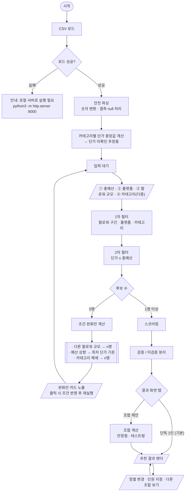
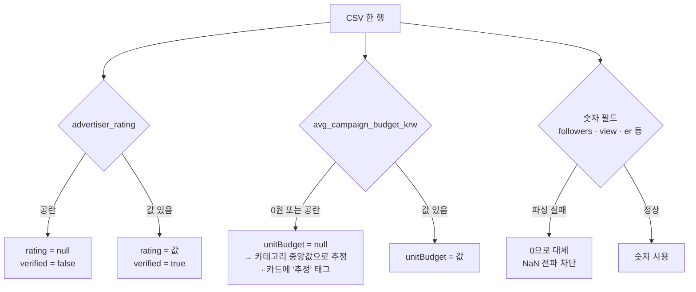
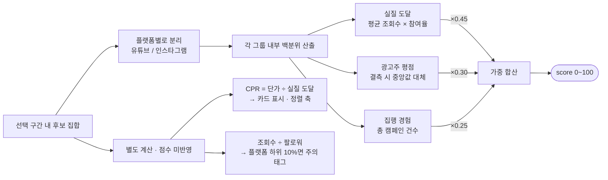
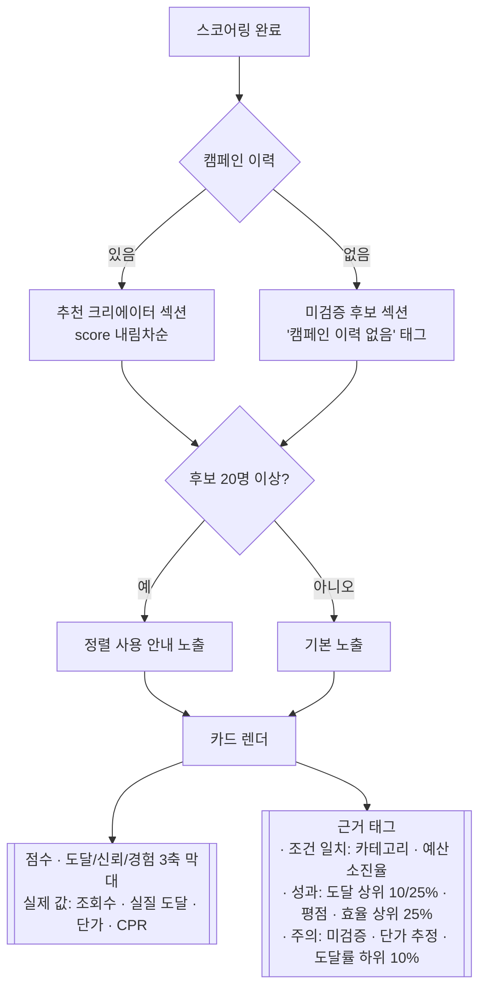
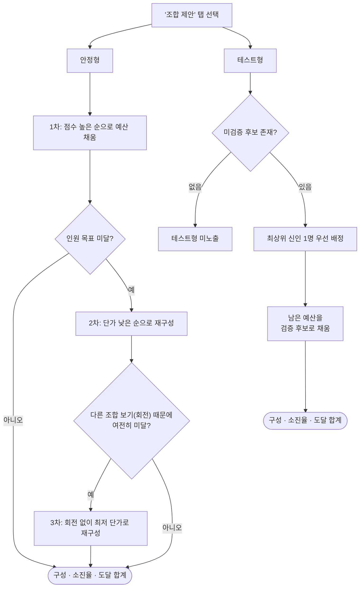

# 로직 흐름

입력부터 추천 결과 출력까지의 전체 흐름입니다. 조건 분기와 예외 처리를 포함합니다.

---

## 1. 전체 흐름

입력은 **네 항목을 순서대로** 받습니다. 예산을 가장 먼저 두는 이유는, 광고주가 기획 단계에서 이미 손에 쥐고 있는 유일한 확정 숫자이기 때문입니다. 나머지 셋은 예산에 따라 조정할 수 있는 조건입니다.

**추천 방식(단독 / 조합)은 입력이 아니라 결과 화면의 탭**입니다. 입력 단계에서 미리 고르게 하면 사용자가 결과를 보기 전에 판단해야 하는데, "1명으로 갈지 여러 명으로 나눌지"는 후보를 본 뒤에 정하는 것이 자연스럽다고 봤습니다.

---

## 2. 데이터 안전 처리

원본 CSV는 수정하지 않고, 로드 시점에 예외를 흡수합니다.

**0원을 결측과 동일하게 처리하는 이유**
`0원 ≤ 모든 예산`이 성립해, 처리하지 않으면 어떤 예산 조건에도 무조건 통과하게 됩니다.

---

## 3. 스코어 계산

지표를 **선택된 팔로워 구간 안에서, 다시 플랫폼별로 나눠** 백분위로 환산합니다.

- **구간 분리** — 규모 편향 상쇄. 매크로를 골랐으면 매크로끼리 비교됩니다.
- **플랫폼 분리** — 조회수/팔로워 중앙값이 유튜브 20.9% · 인스타그램 33.1%로 1.6배 차이나, 섞으면 인스타그램이 구조적으로 유리해집니다.

**CPR과 도달률은 점수에 넣지 않고 별도 표시합니다.** CPR을 가중치에 넣으면 단가가 싼 나노 채널이 항상 상위를 차지해, 도달 절대량이 필요한 캠페인에서 오답이 되기 때문입니다.

---

## 4. 결과 노출 분기

**분리 노출의 근거**
평점을 중립값으로 대체해도 신인 27명은 TOP50에 한 명도 진입하지 못했습니다(집행 경험 축에서 전원 0점). 단일 랭킹으로는 구조적으로 노출되지 않아, 섹션을 분리하고 판단 근거를 태그로 제공하는 방식을 선택했습니다.

---

## 5. 조합 제안 (별도 탭)

**테스트형의 의미**
검증된 후보로 성과를 담보하고 남는 예산으로 신규 채널 1명을 시험하는 구성입니다. 단일 랭킹에서 노출되지 못하는 신인이 **역할로서** 등장하는 경로이기도 합니다.
